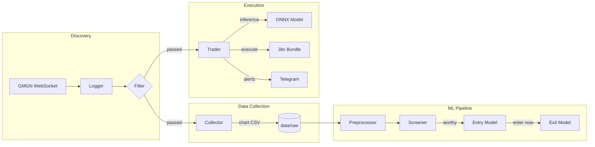

<div align="center">
  <h1>SolSniper</h1>
  <p><strong>Real-time Solana memecoin trading system with ML-driven screening, entry timing, and exit optimization</strong></p>
  <p>
    <a href="#getting-started"></a>
    <a href="#getting-started"></a>
    <a href="models/requirements.txt"></a>
    <a href="#getting-started"></a>
    <a href="#license"></a>
  </p>
</div>

---

## About

SolSniper monitors GMGN.ai for newly launched Solana memecoin pools, applies configurable on-chain filters, and routes qualifying tokens through a three-stage ML pipeline -- screening, entry timing, and exit optimization -- before executing trades via Jito bundles. The system's performance-critical components -- WebSocket ingestion, chart data collection, and trade execution -- are written in C for minimal latency, while the ML pipeline uses Python with PyTorch and XGBoost. An alternative reinforcement learning path trains a PPO agent with curriculum learning to discover profitable strategies without hand-crafted labels. The architecture separates concerns across four independently deployable services: a real-time logger, a data collector, a model training pipeline, and a trading engine, connected through file-based IPC and shared token lists.

## Table of Contents

- [About](#about)
- [Architecture](#architecture)
- [Model Pipeline](#model-pipeline)
  - [Model 1: Screener](#model-1-screener)
  - [Model 2: Entry Timing](#model-2-entry-timing)
  - [Model 3: Exit Optimization](#model-3-exit-optimization)
  - [Alternative: RL Agent](#alternative-rl-agent)
- [Repository Structure](#repository-structure)
- [Getting Started](#getting-started)
- [Configuration](#configuration)
- [GMGN WebSocket API](#gmgn-websocket-api)
- [License](#license)
- [Disclaimer](#disclaimer)

## Architecture



| Component | Language | Description |
|-----------|----------|-------------|
| **Logger** | C | Connects to GMGN.ai WebSocket, streams new pool/token events, applies on-chain filters |
| **Collector** | C | Fetches 1-second candle chart data for filtered tokens, detects token death, writes CSV |
| **Models** | Python | Three-model ensemble (screener + entry + exit) and RL agent with backtesting |
| **Trader** | C | Loads ONNX models, runs inference, executes via Jito bundles or paper trading |

## Model Pipeline

### Model 1: Screener

**Architecture:** XGBoost binary classifier

**Task:** Given the first 30 seconds of candle data after a token launch, predict whether the token will achieve a 2x price ratio within 5 minutes.

**Features (19 dimensions):** Price changes at 5s/15s/30s windows, volume changes, high-low ratio, volatility at multiple scales, trend strength, momentum, RSI, volume trend, price acceleration, and candle body patterns.

**Label:** Binary -- `WORTHY` if peak price reaches 2x entry within the lookahead window, `AVOID` otherwise.

### Model 2: Entry Timing

**Architecture:** LSTM encoder with multi-head self-attention

**Task:** Given a variable-length sequence of candle data for a screener-approved token, predict the optimal moment to enter a position.

**Features (14 dimensions per timestep):** Log-close, 1s/3s/5s returns, range ratio, log-volume, normalized RSI, normalized MACD, Bollinger band deviations, VWAP deviation, momentum, order imbalance, and drawdown.

**Labels:** Three-class -- `ENTER_NOW` (gain >= 20%, drawdown < 15%), `ABORT` (significant drop or declining volume), `WAIT` (unclear signal).

### Model 3: Exit Optimization

**Architecture:** XGBoost classifier with hard-coded risk rules

**Task:** Given current position state and market features, determine whether to hold, partially exit, or fully exit.

**Risk rules override ML predictions:**

| Condition | Action |
|-----------|--------|
| Unrealized loss >= 25% | Exit immediately |
| Drawdown from position high >= 15% | Exit immediately (trailing stop) |
| Unrealized gain >= 200% | Exit immediately (profit target) |
| Position held > 300s with gain < 100% | Exit (time decay) |
| Gain >= 30% with weakening momentum | Partial exit |

### Alternative: RL Agent

**Architecture:** PPO with curriculum learning (Stable-Baselines3)

**Key insight:** Classification-based approaches failed because hand-crafted labels produced degenerate distributions (64% SELL). The RL agent discovers profitable patterns through trial and error in a Gymnasium environment that simulates Solana memecoin trading with realistic fees (2.4% round-trip) and execution delays.

**Training features:**
- **Curriculum learning** -- Gradually increases transaction fees from 0% to 100% during training
- **Catastrophic penalty** -- Applies -35.0 reward if the agent makes zero trades in an episode
- **Hindsight rewards** -- Penalizes the agent for missing profitable opportunities
- **CPC pretraining** -- Optional Contrastive Predictive Coding encoder for learning temporal representations

## Repository Structure

<details>
<summary>Directory layout</summary>

```
SolSniper/
+-- config/                         # Runtime configuration
|   \-- gmgn_logger.conf            # Logger filter + connection settings
+-- data/                           # All datasets
|   +-- raw/                        # Original immutable CSVs
|   +-- processed/                  # Train/val/test splits
|   |   +-- v1/                     # Single-model processed data
|   |   \-- v2/                     # Multi-model processed data
|   \-- scripts/                    # Data processing utilities
+-- models/                         # Python ML pipeline
|   +-- src/
|   |   +-- config/                 # Model hyperparameters
|   |   +-- data/                   # Loading, features, labels, preprocessing
|   |   +-- models/                 # Model architectures
|   |   |   +-- screener.py         # XGBoost screener
|   |   |   +-- entry.py            # LSTM entry timing
|   |   |   +-- exit.py             # XGBoost + risk rules exit
|   |   |   +-- cpc_regression/     # CPC encoder + return regression
|   |   |   \-- rl/                 # PPO agent + Gymnasium environments
|   |   +-- training/               # Trainer classes
|   |   +-- backtesting/            # Backtesting engine + metrics
|   |   \-- utils/                  # Seeding, logging, checkpoints
|   +-- notebooks/                  # Jupyter training notebooks
|   \-- requirements.txt            # Python dependencies
+-- logger/                         # C WebSocket logger
|   +-- src/                        # Source (auto-discovered by Makefile)
|   |   +-- websocket/              # Connection, messaging, callbacks
|   |   +-- tracker/                # Token tracking + API fetchers
|   |   +-- json/                   # JSON parsing + message builders
|   |   +-- output/                 # Terminal display + formatting
|   |   \-- logger/                 # Config parsing + event callbacks
|   +-- include/                    # Public + internal headers
|   \-- Makefile
+-- trader/                         # C trading engine
|   +-- src/
|   |   +-- crypto/                 # Base58, Solana transactions, wallet
|   |   \-- integrations/           # Chart fetch, Jito, Telegram
|   +-- include/                    # Public + internal headers
|   +-- scripts/                    # Python inference helper
|   \-- Makefile
+-- collector/                      # C data collector
|   +-- src/
|   |   +-- collector/              # Chart analysis, CSV export, threading
|   |   \-- main/                   # Config parsing, event callbacks
|   +-- include/                    # Public + internal headers
|   \-- Makefile
+-- scripts/                        # macOS install helpers
\-- legacy/                         # Deprecated JS logger
```

</details>

## Getting Started

### Prerequisites

**C components (logger, trader, collector):**
- GCC or Clang with C99 support
- libwebsockets 4.x
- libcurl
- json-c
- OpenSSL (for trader crypto operations)

**Python components (models):**
- Python 3.10+
- CUDA-capable GPU recommended for training

### Installation

Clone the repository and build the C components:

```bash
git clone <repository-url>
cd SolSniper
```

Build any C component:

```bash
cd logger && make        # WebSocket logger
cd trader && make        # Trading engine
cd collector && make     # Data collector
```

Install Python dependencies:

```bash
cd models
python -m venv .venv && source .venv/bin/activate
pip install -r requirements.txt
```

On macOS, use the provided install script for system dependencies:

```bash
bash scripts/install_macos.sh
```

### Running the Logger

```bash
cd logger
./build/gmgn_logger --config ../config/gmgn_logger.conf
```

### Training Models

Preprocess raw data and train the multi-model pipeline:

```bash
cd models
python src/data/preprocess.py --csv-path ../data/raw/combined_tokens.csv --output-dir ../data/processed/v2
```

Use the Jupyter notebooks for GPU training:
- `notebooks/train_multi_model.ipynb` -- Screener, entry, and exit models
- `notebooks/train_rl_agent.ipynb` -- RL agent with curriculum learning
- `notebooks/train_cpc_regression.ipynb` -- CPC pretraining + return regression

### Running the Trader

```bash
cd trader
cp .env.example .env    # Configure API keys and trading parameters
make
./build/ai_trader
```

## Configuration

### Logger Filters (`config/gmgn_logger.conf`)

| Parameter | Description | Default |
|-----------|-------------|---------|
| `chain` | Target blockchain | `sol` |
| `min_market_cap` | Minimum market cap (USD) | `5500` |
| `max_market_cap` | Maximum market cap (USD) | `10000` |
| `min_liquidity` | Minimum liquidity (USD) | `5000` |
| `min_holder_count` | Minimum token holders | `10` |
| `max_top_10_ratio` | Maximum top-10 holder concentration (%) | `70` |
| `max_creator_ratio` | Maximum creator balance (%) | `50` |
| `max_age_minutes` | Maximum token age | `10` |
| `min_kol_count` | Minimum KOL/influencer count | `1` |
| `exchanges` | Allowed DEXes | `raydium,orca,meteora` |
| `exclude_symbols` | Blacklisted symbol substrings | `SCAM,TEST,FAKE,RUG,HONEY` |

### Trader Settings (`trader/.env`)

| Variable | Description | Default |
|----------|-------------|---------|
| `PAPERTRADE` | Enable paper trading mode | `true` |
| `WALLET_PRIVATE_KEY` | Solana wallet private key (base58) | -- |
| `TRADE_AMOUNT_SOL` | SOL per trade | `0.01` |
| `MAX_POSITIONS` | Maximum concurrent positions | `5` |
| `TAKE_PROFIT_PCT` | Take profit threshold | `0.30` |
| `STOP_LOSS_PCT` | Stop loss threshold | `0.08` |
| `JITO_ENDPOINT` | Jito block engine URL | Amsterdam endpoint |
| `JITO_TIP_LAMPORTS` | Jito tip amount | `50000` |
| `TELEGRAM_BOT_TOKEN` | Telegram alert bot token | -- |
| `TELEGRAM_CHAT_ID` | Telegram alert chat ID | -- |

## GMGN WebSocket API

Critical implementation details discovered during development -- documented here to prevent rework.

**Connection URL:** `wss://ws.gmgn.ai/quotation` with required query parameters (`device_id`, `client_id`, `from_app`, `app_ver`, etc.).

**Subscription format (all fields required):**

```json
{
  "action": "subscribe",
  "channel": "new_pool_info",
  "f": "w",
  "id": "gmgn_00000001",
  "data": [{"chain": "sol"}]
}
```

**Available channels:** `new_pool_info`, `new_pair_update`, `new_launched_info`, `chain_stat`, `wallet_trade_data`.

**Required HTTP headers:** `Origin: https://gmgn.ai` and a standard Chrome user agent string.

See the full API reference in [CLAUDE.md](CLAUDE.md).

## License

MIT License. See `LICENSE` for details.

## Disclaimer

This is experimental software. Cryptocurrency trading -- particularly Solana memecoins -- carries extreme risk including total loss of capital. The authors accept no liability for financial losses. Use at your own risk. Always start with paper trading mode enabled.
